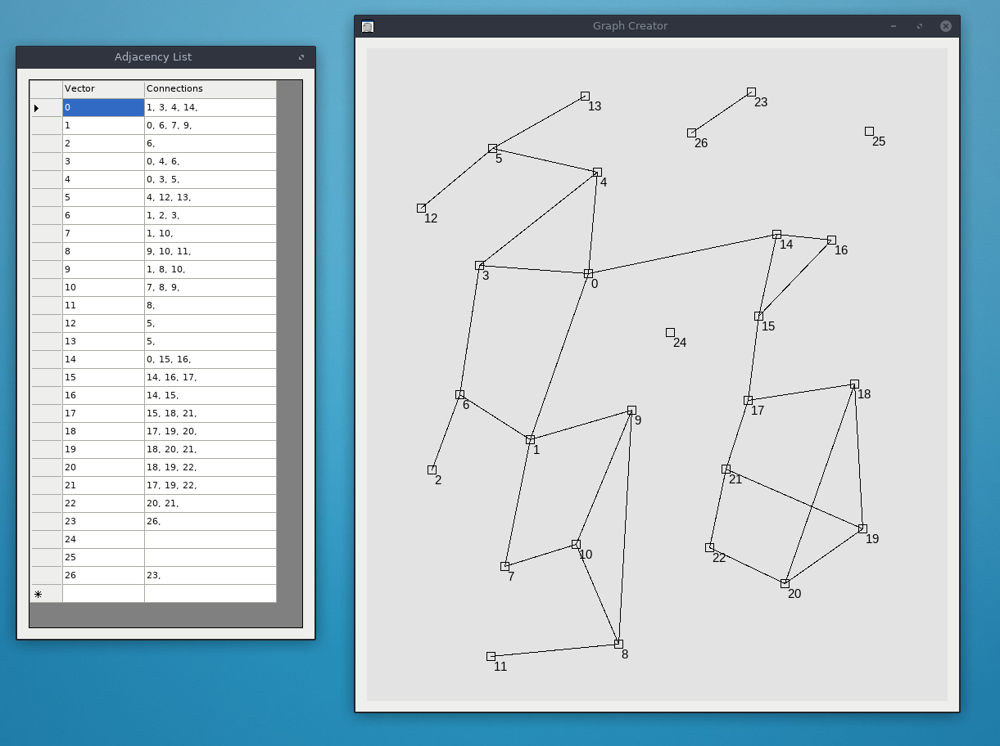

# C# Graph Creator
Create undirected, unweighted graphs and view their adjacency lists

## Compiling

### Windows
`CSharpGraphCreator.sln` should compile and run in Windows Studio 2017.

### Linux / Mac

Requirements:

* Mono
* MSBuild

To compile:

`cd csharp-graph-creator`

`msbuild`

To run:

`mono CSharpGraphCreator/bin/Debug/CSharpGraphCreator.exe`

## Controls

* Left click to create new vertices
* Right click to select a vertex, then:
  * Right click on the same vertex to delete it (removes all connecting edges)
  * Right click on another vertex to create an edge between them
  * Right click elsewhere to deselect
